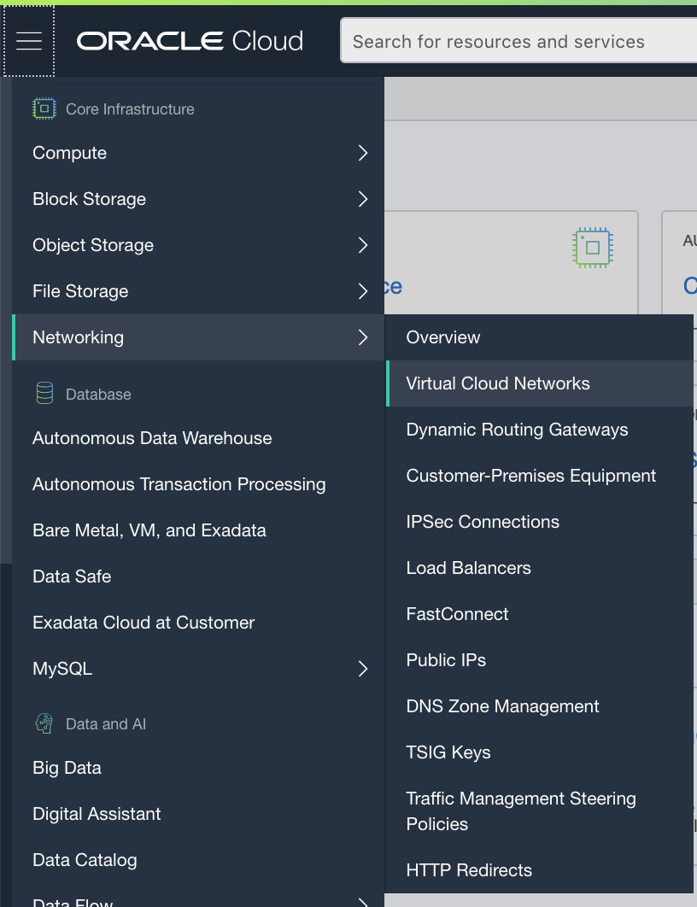
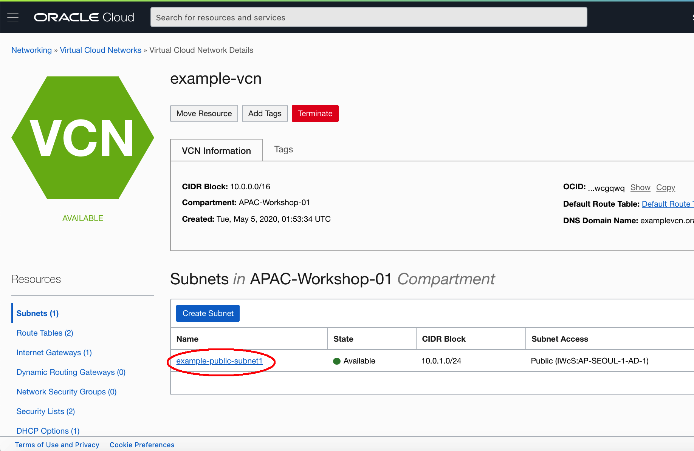
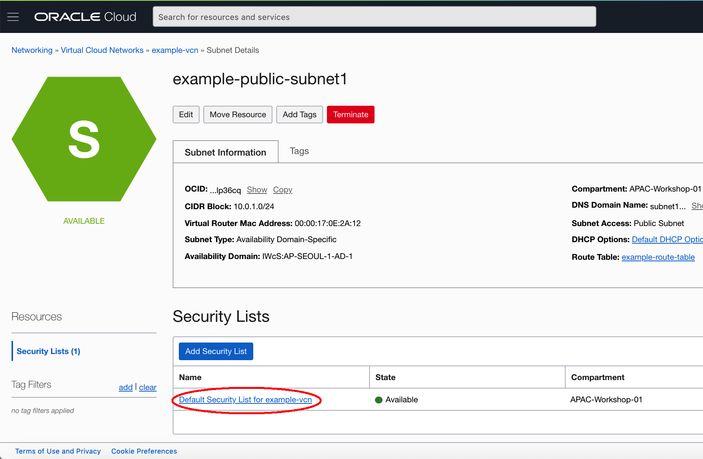
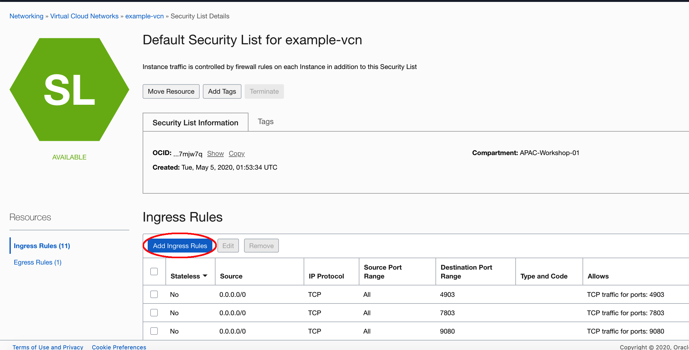
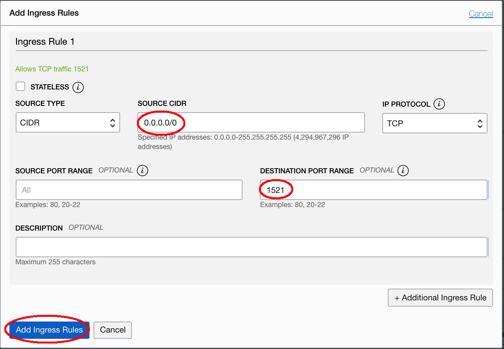

# Prepare On Premise Database

In this lab, You will use a compute instance in the OCI to simulate the on-premise database. In the Lab3, the Oracle 19c database has been installed and patch to 19.5.0. The on-premise database can deploy into different region with the cloud database.

## Lab Prerequisites

This lab assumes you have completed the following labs:

* Register for Free Tier
* Generate SSH Key
* Environment Setup


## Open the 1521 port for the on-premise database

1. From the OCI console, from the main menu, choose **Netwoking** and click **Virtual Cloud Networks**.

   

2. In the Vitual Cloud Networks page, make sure you are in the correct Region and Compartment, there is a VCN named **example-vcn** which you create in Lab3. Click the vcn link.

   

3. From the VCN Details page, click the subnet link.

   

4. Then click the Default Security List link.

   

5. Click **Add Ingress Rules**.

   

6. Set the Soure CIDR to ```0.0.0.0/0``` and the Destination Port Range to 1521. Then click **Add Ingress Rules**.

   

   You are now open the 1521 port for the public subnet.

7. Connect to the VM which you created in Lab3 with opc user. Use putty tools(Windows) or command line(Mac, linux).

   ```
   ssh -i labkey opc@xxx.xxx.xxx.xxx
   ```
  
8. Copy and run the following command to open the 1521 port in the VM.

   ```
   <copy>
   sudo firewall-cmd --zone=public --add-port=1521/tcp --permanent
   sudo firewall-cmd --reload
   sudo firewall-cmd --list-all
   </copy>
   ```

   
## Enable ssh connect for the oracle user

1. Work as opc user, edit the ssh configure file.

```
<copy>sudo vi /etc/ssh/sshd_config</copy>
```

2. Add the following lines in the file.

```
<copy>AllowUsers oracle 
AllowUsers opc</copy>
```

3. Restart the ssh service.

```
<copy>sudo systemctl restart sshd.service</copy>
```


## Enable TDE
 
Oracle MAA best practice recommends using Oracle Transparent Data Encryption (TDE) to encrypt both primary and standby databases to ensure all data is encrypted at-rest. Data can be converted during the migration process but it’s highly recommended to convert to TDE prior to migration to provide the most secure Data Guard environment. 

1. Switch to the **oracle** user.

   ```
   <copy>sudo su - oracle</copy>
   ```

   

2. Create a directory for the wallet.

```
<copy>mkdir -p /u01/app/oracle/admin/ORCL/wallet</copy>
```

3. Edit sqlnet.ora

```
<copy>vi $ORACLE_HOME/network/admin/sqlnet.ora</copy>
```

4. Add following lines to the file, save and exit.

```
<copy>
ENCRYPTION_WALLET_LOCATION =
   (SOURCE = (METHOD = FILE)
     (METHOD_DATA =
      (DIRECTORY = /u01/app/oracle/admin/ORCL/wallet)
     )
   )
</copy>
```

5. Connect to sqlplus as sysdba, create keystore.

```
[oracle@workshop ~]$ sqlplus / as sysdba

SQL*Plus: Release 19.0.0.0.0 - Production on Fri Jan 31 03:26:52 2020
Version 19.5.0.0.0

Copyright (c) 1982, 2019, Oracle.  All rights reserved.


Connected to:
Oracle Database 19c Enterprise Edition Release 19.0.0.0.0 - Production
Version 19.5.0.0.0

SQL> administer key management create keystore '/u01/app/oracle/admin/ORCL/wallet' identified by "Ora_DB4U";

keystore altered.

SQL> 
```

6. Open the keystore.

```
SQL> administer key management set keystore open identified by "Ora_DB4U"  container=all;

keystore altered.

SQL> 
```

7. Create master key.

```
SQL> administer key management set key identified by "Ora_DB4U" with backup using 'backup' container=all;

keystore altered.

SQL>
```

8. Verify the keystore, you can see the wallet is openned by password.

```
SQL> select * from v$encryption_wallet;

WRL_TYPE
--------------------
WRL_PARAMETER
--------------------------------------------------------------------------------
STATUS			       WALLET_TYPE	    WALLET_OR KEYSTORE FULLY_BAC
------------------------------ -------------------- --------- -------- ---------
    CON_ID
----------
FILE
/u01/app/oracle/admin/ORCL/wallet/
OPEN			       PASSWORD 	    SINGLE    NONE     NO
	 1


WRL_TYPE
--------------------
WRL_PARAMETER
--------------------------------------------------------------------------------
STATUS			       WALLET_TYPE	    WALLET_OR KEYSTORE FULLY_BAC
------------------------------ -------------------- --------- -------- ---------
    CON_ID
----------
FILE

OPEN			       PASSWORD 	    SINGLE    UNITED   NO
	 2


WRL_TYPE
--------------------
WRL_PARAMETER
--------------------------------------------------------------------------------
STATUS			       WALLET_TYPE	    WALLET_OR KEYSTORE FULLY_BAC
------------------------------ -------------------- --------- -------- ---------
    CON_ID
----------
FILE

OPEN			       PASSWORD 	    SINGLE    UNITED   NO
	 3


SQL> 
```

9. Make keystore autologin.

```
SQL> administer key management create auto_login keystore from keystore '/u01/app/oracle/admin/ORCL/wallet' identified by "Ora_DB4U";

keystore altered.

SQL> 
```

10. Reset wallet from PASSWORD to AUTOLOGIN mode.

```
SQL> administer key management set keystore close identified by "Ora_DB4U" container=all;

keystore altered.

SQL> 
```

11. Verify the keystore again, now you can see the wallet is configure to autologin.

```
SQL> select * from v$encryption_wallet;

WRL_TYPE
--------------------
WRL_PARAMETER
--------------------------------------------------------------------------------
STATUS			       WALLET_TYPE	    WALLET_OR KEYSTORE FULLY_BAC
------------------------------ -------------------- --------- -------- ---------
    CON_ID
----------
FILE
/u01/app/oracle/admin/ORCL/wallet/
OPEN			       AUTOLOGIN	    SINGLE    NONE     NO
	 1


WRL_TYPE
--------------------
WRL_PARAMETER
--------------------------------------------------------------------------------
STATUS			       WALLET_TYPE	    WALLET_OR KEYSTORE FULLY_BAC
------------------------------ -------------------- --------- -------- ---------
    CON_ID
----------
FILE

OPEN			       AUTOLOGIN	    SINGLE    UNITED   NO
	 2


WRL_TYPE
--------------------
WRL_PARAMETER
--------------------------------------------------------------------------------
STATUS			       WALLET_TYPE	    WALLET_OR KEYSTORE FULLY_BAC
------------------------------ -------------------- --------- -------- ---------
    CON_ID
----------
FILE

OPEN			       AUTOLOGIN	    SINGLE    UNITED   NO
	 3


SQL> 
```


## Encrypt the data files

According to the best practice, you should encrypt all the data files. In this lab, we only encrypt the **USERS** tablespace in the pdb.

1. Connec to the orclpdb, check the encryt status of the tablespace.

```
SQL> alter session set container=orclpdb;

Session altered.

SQL> select tablespace_name, encrypted from dba_tablespaces;

TABLESPACE_NAME 	       ENC
------------------------------ ---
SYSTEM			       NO
SYSAUX			       NO
UNDOTBS1		       NO
TEMP			       NO
USERS			       NO
```

2. Copy and run the command to encrypt the USERS tablespace online.

   ```
   <copy>alter tablespace users encryption online encrypt;</copy>
   ```

   

3.  Check the status. You can see the USERS tablespace has already encrypted.

```
SQL> alter tablespace users encryption online encrypt;

Tablespace altered.

SQL> select tablespace_name, encrypted from dba_tablespaces;

TABLESPACE_NAME 	       ENC
------------------------------ ---
SYSTEM			       NO
SYSAUX			       NO
UNDOTBS1		       NO
TEMP			       NO
USERS			       YES
```


## Enable the Network Encryption

VPN connection or Oracle Net encryption is also required for encryption-in-flight for any other database payload (e.g. data file or redo headers) that are not encrypted by TDE. In this lab, you use public internet connect between on-premise and the cloud, so you need to enable the network encryption.

1. Work as oracle user, connect to the database as sysdba.

   ```
   <copy>sqlplus / as sysdba</copy>
   ```

   

2. Check the network service banner before encrytion.

```
SQL> set linesize 120
SQL> col network_service_banner for a85
SQL> select i.network_service_banner from v$session_connect_info i, v$session s where s.sid=i.sid and s.serial# = i.serial# and s.username = 'SYS';

NETWORK_SERVICE_BANNER
-------------------------------------------------------------------------------------
Oracle Bequeath NT Protocol Adapter for Linux: Version 19.0.0.0.0 - Production
Authentication service for Linux: Version 19.0.0.0.0 - Production
Encryption service for Linux: Version 19.0.0.0.0 - Production
Crypto-checksumming service for Linux: Version 19.0.0.0.0 - Production

SQL> exit
Disconnected from Oracle Database 19c Enterprise Edition Release 19.0.0.0.0 - Production
Version 19.5.0.0.0
[oracle@primary ~]$
```

3. Edit the sqlnet.ora file.

```
<copy>vi $ORACLE_HOME/network/admin/sqlnet.ora</copy>
```

Add following lines in the sqlnet.ora, save and exit.

```
<copy>
SQLNET.ENCRYPTION_SERVER=REQUIRED
SQLNET.CRYPTO_CHECKSUM_SERVER=REQUIRED
SQLNET.ENCRYPTION_TYPES_SERVER=(AES256,AES192,AES128)
SQLNET.CRYPTO_CHECKSUM_TYPES_SERVER=(SHA1)
SQLNET.ENCRYPTION_CLIENT=REQUIRED
SQLNET.CRYPTO_CHECKSUM_CLIENT=REQUIRED
SQLNET.ENCRYPTION_TYPES_CLIENT=(AES256,AES192,AES128)
SQLNET.CRYPTO_CHECKSUM_TYPES_CLIENT=(SHA1)
</copy>
```

4. Check the network service banner again, the network encryption is enable now.

```
[oracle@workshop ~]$ sqlplus / as sysdba

SQL*Plus: Release 19.0.0.0.0 - Production on Fri Jan 31 03:51:46 2020
Version 19.5.0.0.0

Copyright (c) 1982, 2019, Oracle.  All rights reserved.


Connected to:
Oracle Database 19c Enterprise Edition Release 19.0.0.0.0 - Production
Version 19.5.0.0.0

SQL> set linesize 120
SQL> col network_service_banner for a85
SQL> select i.network_service_banner from v$session_connect_info i, v$session s where s.sid=i.sid and s.serial# = i.serial# and s.username = 'SYS';

NETWORK_SERVICE_BANNER
-------------------------------------------------------------------------------------
Oracle Bequeath NT Protocol Adapter for Linux: Version 19.0.0.0.0 - Production
Authentication service for Linux: Version 19.0.0.0.0 - Production
Encryption service for Linux: Version 19.0.0.0.0 - Production
AES256 Encryption service adapter for Linux: Version 19.0.0.0.0 - Production
Crypto-checksumming service for Linux: Version 19.0.0.0.0 - Production
SHA1 Crypto-checksumming service adapter for Linux: Version 19.0.0.0.0 - Production

6 rows selected.

SQL> 
```


## Enable achivelog and flashback

1. Check the achivelog mode, you can found it's disable now.

```
SQL> archive log list
Database log mode	       No Archive Mode
Automatic archival	       Disabled
Archive destination	       USE_DB_RECOVERY_FILE_DEST
Oldest online log sequence     10
Current log sequence	       12
SQL> 
```

2. Enable the archive mode and flashback on.

```
SQL> shutdown immediate
Database closed.
Database dismounted.
ORACLE instance shut down.
SQL> startup mount
ORACLE instance started.

Total System Global Area 6845104048 bytes
Fixed Size		    9150384 bytes
Variable Size		 1275068416 bytes
Database Buffers	 5553258496 bytes
Redo Buffers		    7626752 bytes
Database mounted.
SQL> alter database archivelog;

Database altered.

SQL> alter database flashback on;

Database altered.

SQL> alter database open;

Database altered.

SQL> 
```

3. Check the status again, it's enable now.

```
SQL> archive log list
Database log mode	       Archive Mode
Automatic archival	       Enabled
Archive destination	       USE_DB_RECOVERY_FILE_DEST
Oldest online log sequence     10
Next log sequence to archive   12
Current log sequence	       12
SQL> 
```

4. Enable force logging.

```
SQL> alter database force logging;

Database altered.

SQL>
```


## Change redo log size and create standby log

1. Change the redo log size to 1024M according to the best practice. Check the status of the redo log first.

```
SQL> select group#, bytes, status from v$log;

    GROUP#	BYTES STATUS
---------- ---------- ----------------
	 1  209715200 INACTIVE
	 2  209715200 INACTIVE
	 3  209715200 CURRENT
```

2. Add 3 new redo log group.

```
<copy>
alter database add logfile group 4 '/u01/app/oracle/oradata/ORCL/redo04.log' size 1024M; 
alter database add logfile group 5 '/u01/app/oracle/oradata/ORCL/redo05.log' size 1024M; 
alter database add logfile group 6 '/u01/app/oracle/oradata/ORCL/redo06.log' size 1024M;
</copy>
```

3. Switch the logfile serveral times.

```
<copy>
alter system switch logfile;
alter system checkpoint;
</copy>
```

4. Check the status again.

```
SQL> select group#, bytes, status from v$log;

    GROUP#	BYTES STATUS
---------- ---------- ----------------
	 1  209715200 INACTIVE
	 2  209715200 INACTIVE
	 3  209715200 INACTIVE
	 4 1073741824 CURRENT
	 5 1073741824 UNUSED
	 6 1073741824 UNUSED

6 rows selected.

SQL> 
```

5. When the first 3 groups status is INACTIVE, you can drop these group now.

```
SQL> alter database drop logfile group 1; 

Database altered.

SQL> alter database drop logfile group 2; 

Database altered.

SQL> alter database drop logfile group 3; 

Database altered.

SQL> 
```

6. Create 4 standby log group.

```
SQL> alter database add standby logfile '/u01/app/oracle/oradata/ORCL/srl_redo01.log' size 1024M;

Database altered.

SQL> alter database add standby logfile '/u01/app/oracle/oradata/ORCL/srl_redo02.log' size 1024M;

Database altered.

SQL> alter database add standby logfile '/u01/app/oracle/oradata/ORCL/srl_redo03.log' size 1024M;

Database altered.

SQL> alter database add standby logfile '/u01/app/oracle/oradata/ORCL/srl_redo04.log' size 1024M;

Database altered.

SQL> select group#,thread#,bytes from v$standby_log;

    GROUP#    THREAD#	   BYTES
---------- ---------- ----------
	 1	    0 1073741824
	 2	    0 1073741824
	 3	    0 1073741824
	 7	    0 1073741824

SQL> 
```


## Alter the init parameters for best practice

Alter some parameters for best practice.

```
SQL> alter system set STANDBY_FILE_MANAGEMENT=AUTO scope=both;

System altered.

SQL> alter system set DB_LOST_WRITE_PROTECT=TYPICAL scope=both;

System altered.

SQL> alter system set FAST_START_MTTR_TARGET=300 scope=both;

System altered.

SQL> exit;
```

