# Provision the Database System on OCI

In this lab, you will provision a Database system on OCI to act as the standby database in the cloud. You can provision the Cloud database in the different region with the on-premise database.

## Create the VCN

1. Open the navigation menu. Under **Core Infrastructure**, go to **Networking** and click **Virtual Cloud Networks**.

   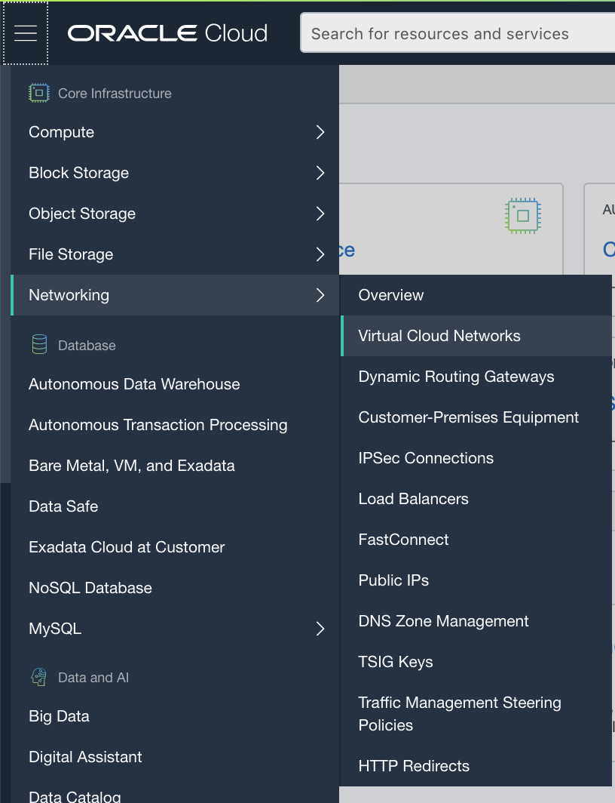

2. Click **Start VCN Wizard**.

   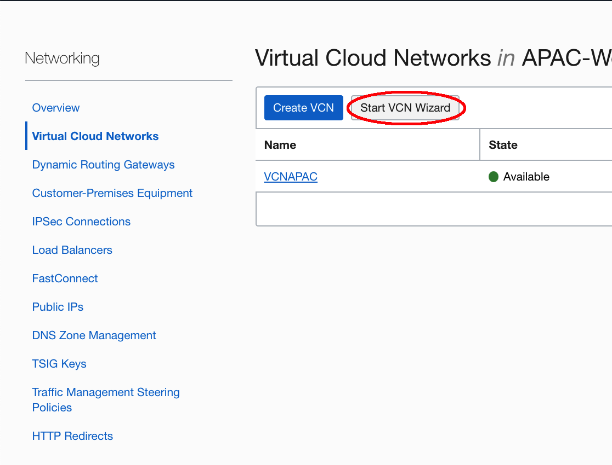

3. Select **VCN with Internet Connectivity**, and then click **Start Workflow**. 

   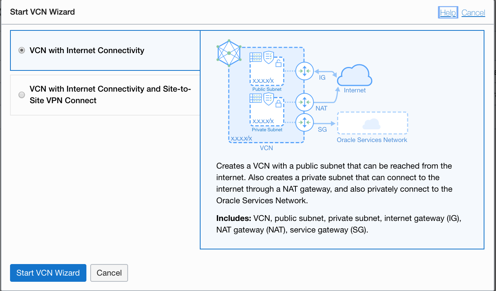

4. Enter a unique VCN Name and following value:

   - VCN CIDR BLOCK: 10.0.0.0/16
   - Public Subnet CIDR Block: 10.0.0.0/24
   - Private Subnet CIDR Block: 10.0.1.0/24

   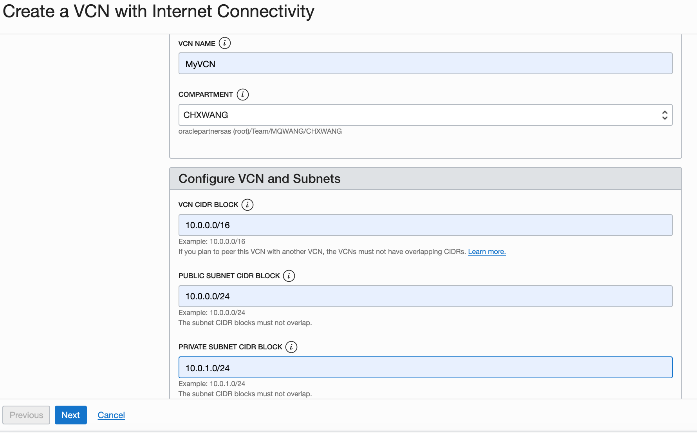

5. Click **Next**, review the VCN and click **Create**.

6. In the VCN detail page, click **Security Lists** under Resources, then click the **Default Security List** link.

   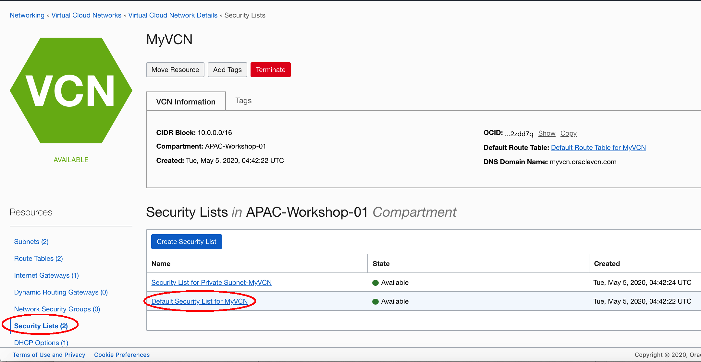

7. Click **Add Ingress Rules**.

   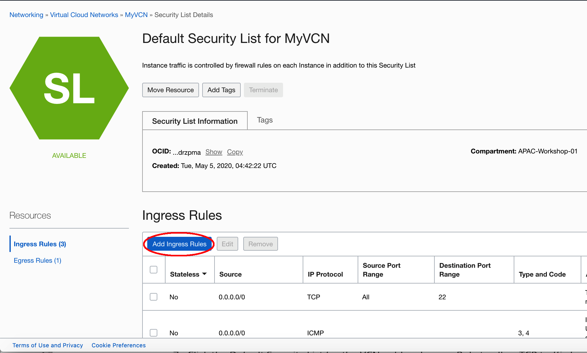

8. Add an Ingress Rule to allow TCP traffic for port 1521, 

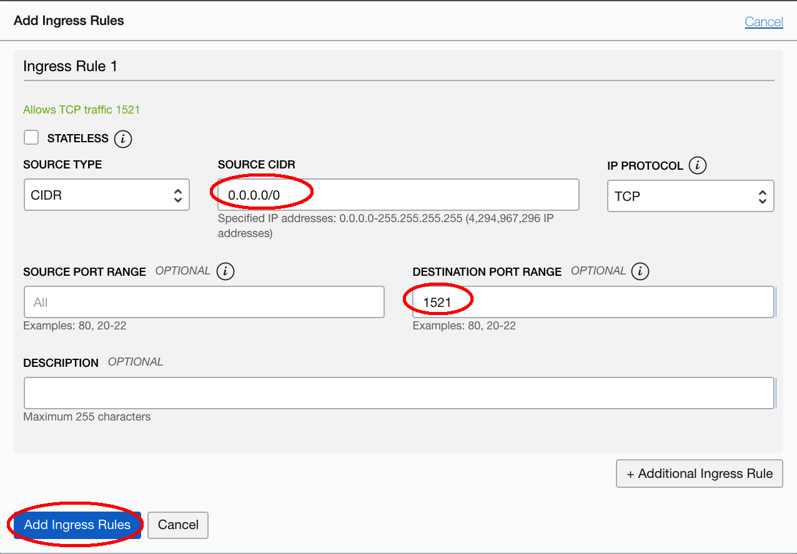

##Create the DB system

1. Open the navigation menu. Under **Database**, click **Bare Metal, VM, and Exadata**.

2. Click **Create DB System**.

3. On the **Create DB System** page, provide the basic information for the DB system:

   - **Select a compartment:** use the compartment which assign to you.
   - **Name your DB system:** enter a unique name of your DB system
   - **Select an availability domain:** The **availability domain** in which the DB system resides.
   - **Select a shape type:** Choose **Virtual Machine**
   - **Select a shape:** change the Shape to **VM.Stanard2.2**

   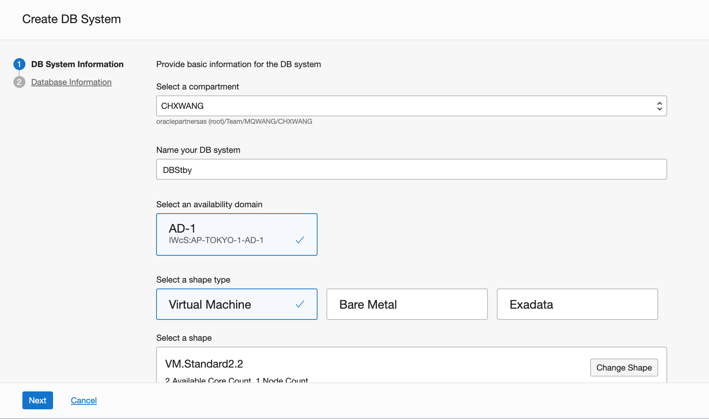

   

4. **Configure the DB system:** Specify the following:

   - **Total node count:** 1
   - **Oracle Database software edition:** choose **Enterprise Extreme Performance**.
   - **Storage Management Software:**  choose the storage management software according to your instructor. You will do the differenct **Lab6** base on your choice. Select **Oracle Grid Infrastructure** to use Oracle Automatic Storage Management (recommended for production workloads). Select **Logical Volume Manager** to quickly provision your DB system using Logical Volume Manager storage management software. 

   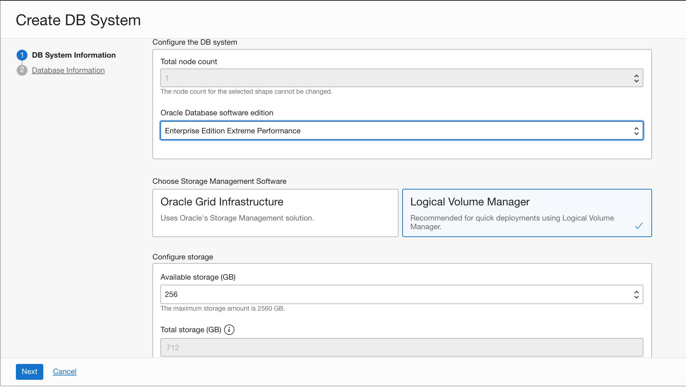

   - Accept the default storage.
   - Upload the public SSH Keys file which you create in Lab2.

   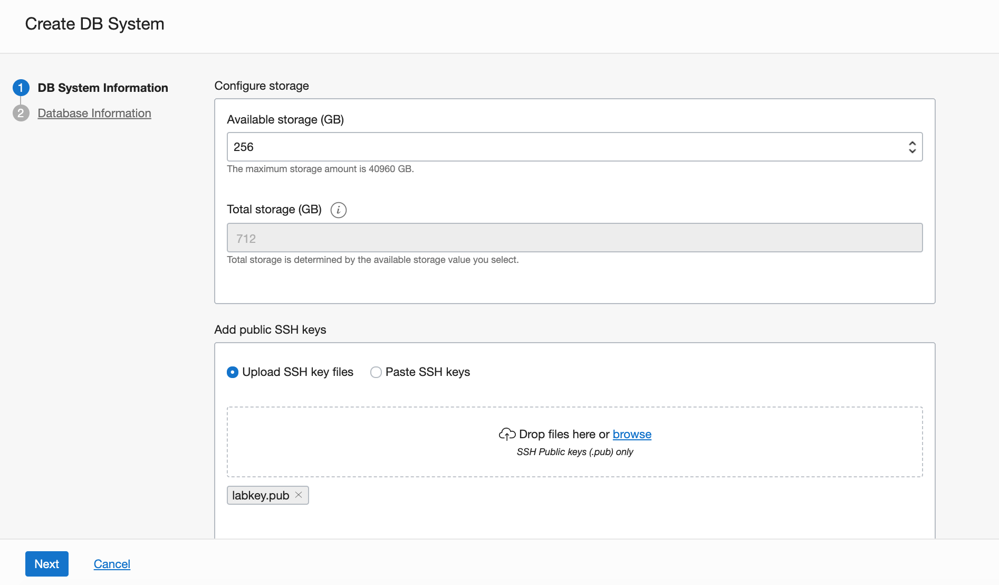

   - License type: choose **Bring Your Own License**
   - Choose the VCN you created before and choose the **Public Subnet**, enter the Hostname prefix.

   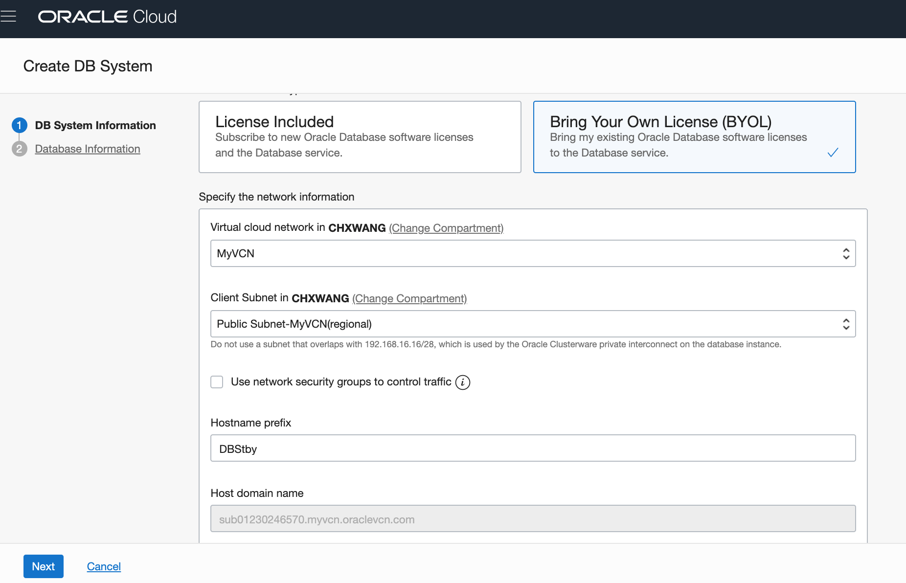

   - click **Next**

   5. In the **Database Information** page, Specify the following:

   - **Databse name:** **ORCL**, same as the on premise database
   - Check the Display allavailable versions box, select the Database version: 19.5.0.0. same version as the on premise database
   - PDB name: orclpdb

   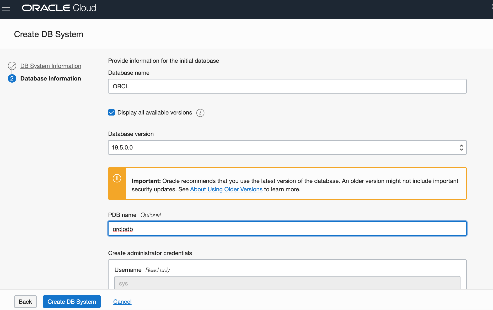

   - Enter the password like Ora_DB4U
   - Workload type: OLTP

   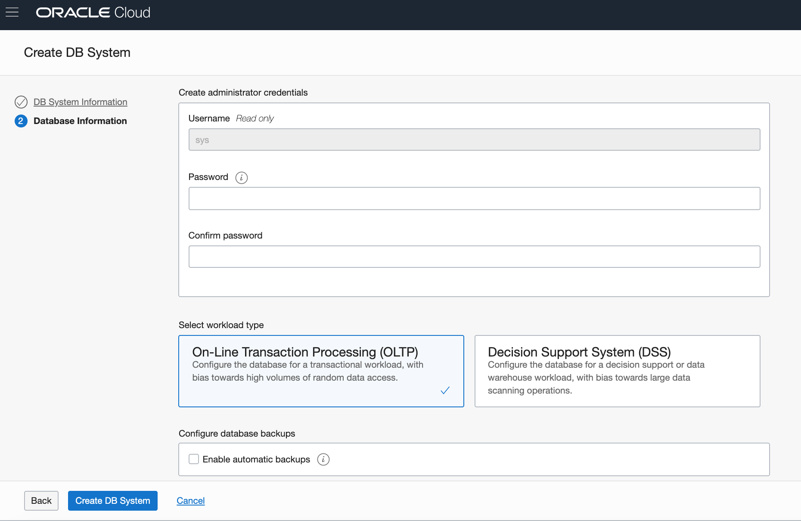

   - Click the **Create DB System**.

   6. If you choose ASM as the storage manage, wait about 60 minutes. If you choose LVM as the storage manage, wait about 15 minutes. Then the Database is ready.

   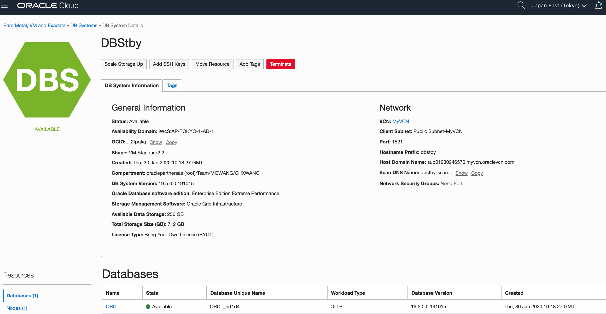

7. Remmeber and write down the Database Unique Name like *ORCL_nrt1d4*.
8. Click the **Nodes**,  write down the public ip address of the database host node and the Host Domain Name.

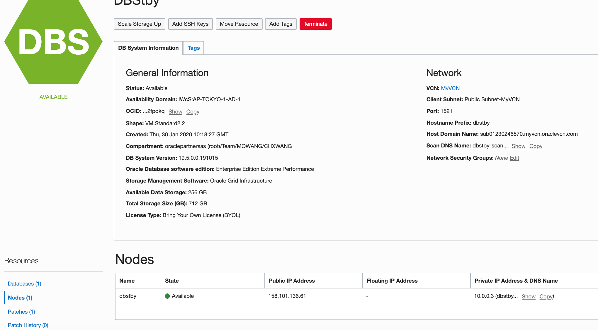

Now you are complete to Provisioning the Database System steps.